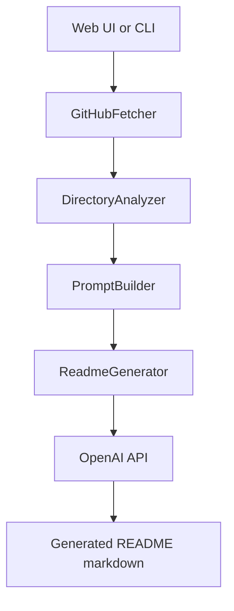

# README Generator AI

Generate high-quality `README.md` files from a local codebase or a GitHub repository using OpenAI.

This project includes:
- a Next.js web app (`/`) for interactive generation and preview
- a terminal CLI (`readme-gen`) for fast local workflows
- an API endpoint (`/api/generate`) for programmatic usage

## Minimal Setup

Copy, paste, and run:

```bash
cd "/Users/sairammaruri/Documents/New git projects/readme-generator-ai"
npm install
cp .env.local.example .env.local
# edit .env.local and set OPENAI_API_KEY
npm run build:cli
npm run dev
```

Then open [http://localhost:3000](http://localhost:3000).

## Why This Project

Writing good project documentation is repetitive and easy to postpone. This tool automates the first 80% by:
- scanning project structure and metadata
- detecting language, framework, package manager, scripts, and license
- generating structured markdown with optional sections and style controls

## Key Features

- Repository analysis for JavaScript/TypeScript, Python, Go, Rust, and Java
- GitHub URL input (public repos, private repos with token)
- Multiple README styles: `minimal`, `detailed`, `enterprise`
- Section toggles (badges, TOC, architecture, installation, usage, API, env, structure, contributing, license)
- Caching to reduce repeated OpenAI calls
- API rate limiting on generation endpoint
- Web preview with copy/download support
- CLI interactive mode for section selection

## Architecture



## Prerequisites

- Node.js `>=18`
- npm
- OpenAI API key

## Environment Variables

Create `.env.local` from the example:

```bash
cp .env.local.example .env.local
```

| Variable | Required | Default | Description |
|---|---|---|---|
| `OPENAI_API_KEY` | Yes | - | OpenAI API key used for generation |
| `OPENAI_MODEL` | No | `gpt-4o-mini` | OpenAI model name override |
| `GITHUB_TOKEN` | No | - | Improves GitHub API limits and enables private repo access |
| `README_GEN_CACHE_DIR` | No | auto | Optional cache directory override |

## Quick Start

```bash
git clone <your-repo-url>
cd readme-generator-ai
npm install
cp .env.local.example .env.local
# edit .env.local and set OPENAI_API_KEY
npm run build:cli
npm run dev
```

Open [http://localhost:3000](http://localhost:3000).

## Run in Terminal (CLI)

Build CLI artifacts first:

```bash
npm run build:cli
```

Run from source checkout:

```bash
node bin/readme-gen.js . --output README.generated.md
```

Generate from GitHub URL:

```bash
node bin/readme-gen.js --github https://github.com/owner/repo --output README.generated.md
```

Use style and interactive mode:

```bash
node bin/readme-gen.js . --style enterprise --interactive
```

If installed globally from npm (when published), you can use:

```bash
readme-gen .
```

## Web App Usage

1. Start app: `npm run dev`
2. Open `http://localhost:3000`
3. Enter GitHub repository URL
4. Choose style and sections
5. Generate README
6. Copy or download markdown

## API Usage

### Generate README

```bash
curl -X POST http://localhost:3000/api/generate \
  -H "Content-Type: application/json" \
  -d '{
    "githubUrl": "https://github.com/vercel/next.js",
    "style": "detailed",
    "sections": {
      "badges": true,
      "toc": true,
      "architecture": true,
      "installation": true,
      "usage": true,
      "api": true,
      "env": true,
      "structure": true,
      "contributing": true,
      "license": true
    }
  }'
```

### Health Check

```bash
curl http://localhost:3000/api/health
```

## Available Scripts

| Script | What it does |
|---|---|
| `npm run dev` | Start Next.js development server |
| `npm run build:cli` | Compile core TypeScript modules to `dist/` for CLI |
| `npm run build` | Build CLI artifacts and Next.js production app |
| `npm run start` | Start production server |
| `npm run lint` | Run Next.js ESLint checks |
| `npm run clean` | Remove `dist` and `.next` |

## Project Structure

```text
readme-generator-ai/
  app/
    api/
      generate/route.ts
      health/route.ts
    components/
      Preview.tsx
      SectionToggle.tsx
      LoadingSpinner.tsx
    page.tsx
    layout.tsx
    globals.css
  src/core/
    analyzer.ts
    generator.ts
    github-fetcher.ts
    prompt-builder.ts
    cache.ts
    rate-limiter.ts
    types.ts
    utils.ts
  bin/
    readme-gen.js
  middleware.ts
  tsconfig.json
  tsconfig.cli.json
```

## Troubleshooting

### `OPENAI_API_KEY environment variable not set`
Set `OPENAI_API_KEY` in `.env.local` (web) or export in your shell (CLI).

### `CLI core modules are not built yet`
Run `npm run build:cli` before `node bin/readme-gen.js ...`.

### GitHub rate limit errors
Set `GITHUB_TOKEN` in `.env.local` or shell environment.

### Empty or low-quality output
Try:
- a different `OPENAI_MODEL`
- `enterprise` style
- enabling more sections

## Deployment

### Vercel

Set these environment variables:
- `OPENAI_API_KEY`
- `OPENAI_MODEL` (optional)
- `GITHUB_TOKEN` (optional)

### Docker

```dockerfile
FROM node:18-alpine
WORKDIR /app
COPY package*.json ./
RUN npm install
COPY . .
RUN npm run build
EXPOSE 3000
CMD ["npm", "start"]
```

```bash
docker build -t readme-generator-ai .
docker run -p 3000:3000 \
  -e OPENAI_API_KEY=your_key \
  -e OPENAI_MODEL=gpt-4o-mini \
  -e GITHUB_TOKEN=your_token \
  readme-generator-ai
```

## License

Licensed under Apache-2.0. See [LICENSE](LICENSE).

## Contributing

Pull requests are welcome. Keep changes focused, include validation steps, and update docs when behavior changes.
